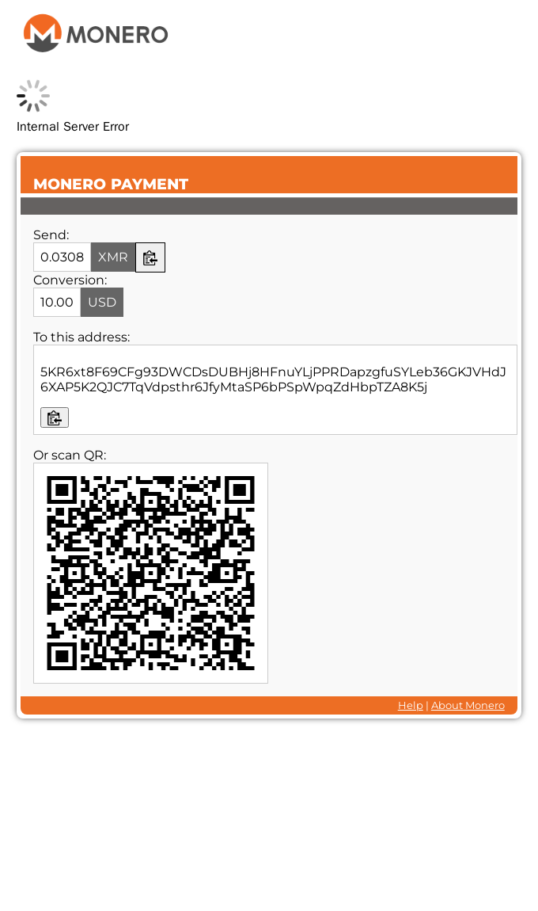
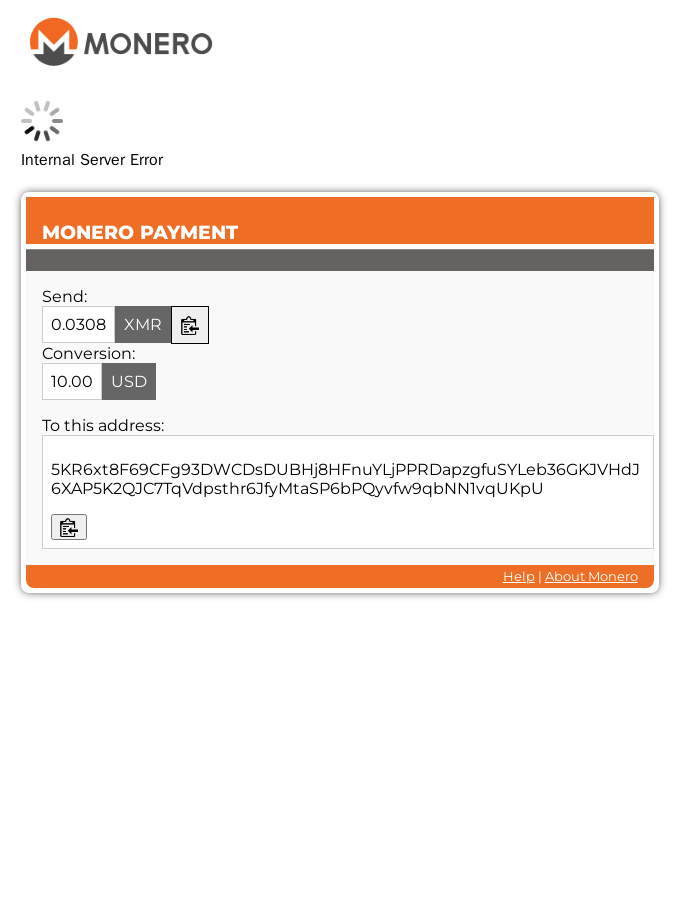

# Evidence

Tested in Docker on WHMCS 8.13.4 and 9.0.5 (PHP 8.3), with a stagenet `monero-wallet-rpc`.

## The fatal that broke it (before the fix)

Rendering the gateway pay page on PHP 8.3, exactly as WHMCS does when a customer opens the invoice:

```
FATAL: Call to undefined function money_format()
```

After the fix the pay page renders, the price is fetched (CoinGecko, with a Kraken fallback), the
amount is converted to XMR, and the payment screen opens. Verified on both WHMCS 8.13.4 and 9.0.5.

## Adding and configuring the gateway in the WHMCS admin

The reported symptom was not being able to add a working Monero gateway. On current WHMCS (8.13.4
and 9.0.5) the module activates and its admin config form renders fine, before and after this fix.
What made it unusable was the checkout fatal (`money_format`) and the dead price feed, so you could
add the gateway but a customer could never finish paying. With those fixed the whole flow works.
Here is the admin flow on the fixed module: activate, save the settings, re-open the config page,
and the settings are still there on both versions:

WHMCS 8.13.4

```
activate() -> OK
shows as an active gateway: YES (name=Monero)
saved config persists: address=95 chars, daemon_host=walletrpc, port=18083
```

WHMCS 9.0.5

```
activate() -> OK
shows as an active gateway: YES (name=Monero)
saved config persists: address=95 chars, daemon_host=walletrpc, port=18083
```

The stored address is a full Monero primary address (95 characters), which round-trips through
WHMCS's encrypted gateway settings without truncation. Together with the checkout below, this covers
the broken admin and checkout path on PHP 8.x.

## Checkout, local QR branch (`fix-php8-local-qr`)

The checkout shows the amount, a per-payment integrated address, and a QR generated locally in the
browser with the bundled MIT library. It no longer calls an external QR service.



## Checkout, no-QR branch (`fix-php8-no-qr`)

The same checkout with the copiable address and no QR, which is the smallest change that still
satisfies "QR or copiable address" and keeps everything self-hosted.



## Notes

- The integrated address shown is real, returned by `make_integrated_address` from a stagenet
  `monero-wallet-rpc` (a view-only wallet built from an address and view key).
- The small loading indicator near the top is the payment poll. In this screenshot run the test
  wallet-rpc was offline, so the poll could not reach a daemon. Against a live daemon it reads
  "Waiting for your payment" and follows the existing payment detection path. The detection logic in
  `verify.php` was not redesigned, only the PHP 8 compatibility shims were added.
